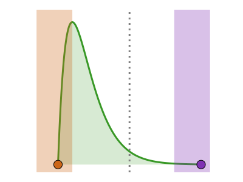

# CensoredDistributions.jl 

| **Documentation** | **Build Status** | **Code Quality** | **License & DOI** | **Downloads** |
|:-----------------:|:----------------:|:----------------:|:-----------------:|:-------------:|
| [](https://censoreddistributions.epiaware.org/stable/) [](https://censoreddistributions.epiaware.org/dev/) | [](https://github.com/EpiAware/CensoredDistributions.jl/actions/workflows/test.yaml) [](https://codecov.io/gh/EpiAware/CensoredDistributions.jl) | [](https://github.com/SciML/SciMLStyle) [](https://github.com/JuliaTesting/Aqua.jl) [](https://github.com/aviatesk/JET.jl) | [](https://opensource.org/licenses/MIT) [](https://doi.org/10.5281/zenodo.18474651) | [](https://juliapkgstats.com/pkg/CensoredDistributions) [](https://juliapkgstats.com/pkg/CensoredDistributions) |

| AD backends | ForwardDiff | ReverseDiff (tape) | Enzyme forward | Enzyme reverse | Mooncake reverse | Mooncake forward |
|:---:|:---:|:---:|:---:|:---:|:---:|:---:|
| [](https://github.com/EpiAware/CensoredDistributions.jl/actions/workflows/ad.yaml) | [](https://app.codecov.io/gh/EpiAware/CensoredDistributions.jl?flags%5B0%5D=ad-forwarddiff) | [](https://app.codecov.io/gh/EpiAware/CensoredDistributions.jl?flags%5B0%5D=ad-reversediff) | [](https://app.codecov.io/gh/EpiAware/CensoredDistributions.jl?flags%5B0%5D=ad-enzyme-forward) | [](https://app.codecov.io/gh/EpiAware/CensoredDistributions.jl?flags%5B0%5D=ad-enzyme-reverse) | [](https://app.codecov.io/gh/EpiAware/CensoredDistributions.jl?flags%5B0%5D=ad-mooncake-reverse) | [](https://app.codecov.io/gh/EpiAware/CensoredDistributions.jl?flags%5B0%5D=ad-mooncake-forward) |

*Primary event censored distributions for Distributions.jl*


## Why CensoredDistributions.jl?

- A study rarely observes exact event times: the initial event (e.g. exposure) is usually known only to within a window, and the delay itself is truncated by when observation stops; ignoring either biases the fitted distribution.
- Primary event censoring, interval censoring, and their combination (double interval censoring) are each one function call on an ordinary `Distributions.jl` distribution, not a hand-derived likelihood correction.
- Every result stays a `Distributions.jl` distribution, so it drops into [Turing.jl](https://github.com/TuringLang/Turing.jl) (or any PPL built on Distributions.jl) for Bayesian inference or maximum likelihood fitting exactly like an ordinary distribution.
- Closed-form solutions are used where they exist, with numerical fallbacks otherwise, so correctness is not traded for convenience.
- Automatic differentiation works across the same wrappers, so a censored or truncated delay is fit-ready with a gradient-based sampler.

## Getting started

For a detailed walkthrough of primary censoring, truncation, interval censoring, and all supported distribution operations (PDF, CDF, quantiles, moments, sampling, fitting), see the [Getting Started documentation](https://censoreddistributions.epiaware.org/stable/getting-started/).

The following example demonstrates how to create a double interval censored distribution (combines primary event, interval censoring, and right truncation (using `Distributions.truncated`)):

```julia
using CensoredDistributions, Distributions
using CairoMakie, AlgebraOfGraphics, DataFramesMeta

CairoMakie.activate!(type = "png", px_per_unit = 2)

# Create a censored distribution accounting for primary and secondary censoring
original = Gamma(2, 3)
censored = double_interval_censored(original; upper = 15, interval = 1)

# Compare the distributions
x = 0:0.01:20
df = vcat(
    DataFrame(x = x, pdf = pdf.(original, x),
        Distribution = "Original Gamma"),
    DataFrame(x = x, pdf = pdf.(censored, x),
        Distribution = "Double Censored and right truncated")
)
draw(
    data(df) *
    mapping(:x, :pdf, color = :Distribution) *
    visual(Lines, linewidth = 2)
)
```

You can fit censored distributions to data using [Turing.jl](https://github.com/TuringLang/Turing.jl) and any of its supported inference methods.
For example, using MCMC for Bayesian inference:

```julia
using Turing, StatsBase

# Generate synthetic data from the censored distribution
data = rand(censored, 1000)

# Get counts of unique values for weighted likelihood
values = unique(data)
weights = [count(==(val), data) for val in values]

# Define a Turing model for fitting with weighted likelihood
@model function double_censored_model(values, weights)
    # Priors for Gamma parameters - weakly informative, not centered on true values
    α ~ truncated(Normal(1, 2), 0, Inf)
    θ ~ truncated(Normal(1, 2), 0, Inf)

    # Create the censored distribution
    censored_dist = double_interval_censored(Gamma(α, θ); upper = 15, interval = 1)

    # Vectorized weighted likelihood
    values ~ weight(censored_dist, weights)
end

# Fit using MCMC for Bayesian inference
model = double_censored_model(values, weights)
chain = sample(model, NUTS(), MCMCThreads(), 1000, 2; progress = false)

# Summarise the posterior
summarystats(chain)
```

Or fit using MAP:

```julia
map_result = maximum_a_posteriori(model)
```

## Relationship to Distributions.jl

Both CensoredDistributions.jl and Distributions.jl's built-in `censored()` function handle censoring, but they address different types of uncertainty:

| Aspect | Distributions.jl `censored()` | CensoredDistributions.jl |
|--------|-------------------------------|---------------------------|
| **Type** | Observation censoring | Event timing censoring |
| **Question** | "Can't measure outside bounds?" | "Don't know exactly when it happened?" |
| **Example** | Lab test detection limits | Disease onset within time window |
| **Use case** | Measurement limitations | Epidemiological modeling |

These approaches complement each other - you can apply observation limits to distributions with event timing uncertainty when both types of censoring affect your data.

CensoredDistributions.jl also works well with `truncated()` from Distributions.jl and supports both primary event censoring (initial event timing uncertainty) and secondary event censoring (observation window effects).

## Related packages

- [ComposedDistributions.jl](https://composeddistributions.epiaware.org/dev/) composes any `Distributions.jl` distribution into event-tree chains, so a censored or truncated delay from this package works as an ordinary leaf.
- [ConvolvedDistributions.jl](https://convolveddistributions.epiaware.org/dev/) convolves independent delays into sums, differences and products, and reads a double-interval-censored distribution's discretised masses directly when convolving a count series.
- [ModifiedDistributions.jl](https://modifieddistributions.epiaware.org/dev/) rescales, weights and hazard-modifies any distribution; those modifiers compose with a censored or truncated distribution since it is an ordinary `Distributions.jl` distribution underneath.
- [DistributionsInference.jl](https://github.com/EpiAware/DistributionsInference.jl) is the emerging fit-protocol and PPL-integration layer across the EpiAware distribution packages.

## Where to learn more

- Want to get started running code? Check out the [Getting started tutorials](https://censoreddistributions.epiaware.org/stable/getting-started/).
- Want to understand the API? Check out our [API Reference](https://censoreddistributions.epiaware.org/stable/lib/public).
- Want to chat with someone about `CensoredDistributions`? Post on our [GitHub Discussions](https://github.com/EpiAware/CensoredDistributions.jl/discussions).
- Want to contribute to `CensoredDistributions`? Check out our [Developer Documentation](https://censoreddistributions.epiaware.org/stable/developer/).
- Want to see our code? Check out our [GitHub Repository](https://github.com/EpiAware/CensoredDistributions.jl/).

## Supporting and citing

If you would like to help support CensoredDistributions.jl, please star the repository as such metrics may help us secure funding in the future.

If you use CensoredDistributions.jl in your work, please cite it:

```bibtex
@software{CensoredDistributions_jl,
  author       = {Abbott, Sam and Bayer, Damon and Brand, Sam and DeWitt, Michael and Lemaitre, Joseph},
  title        = {CensoredDistributions.jl},
  year         = {2025},
  doi          = {10.5281/zenodo.18474652},
  url          = {https://github.com/EpiAware/CensoredDistributions.jl}
}
```

## Contributing

We welcome contributions and new contributors!
We particularly appreciate help on [identifying and identified issues](https://github.com/EpiAware/CensoredDistributions.jl/issues).
Please check and add to the issues, and/or add a [pull request](https://github.com/EpiAware/CensoredDistributions.jl/pulls) and see our [developer documentation](https://censoreddistributions.epiaware.org/stable/developer/) for more information.

## Code of conduct

Please note that the `CensoredDistributions` project is released with a [Contributor Code of Conduct](https://github.com/EpiAware/.github/blob/main/CODE_OF_CONDUCT.md). By contributing to this project, you agree to abide by its terms.
